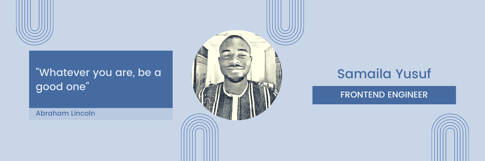

### Hi there 👋

Welcome to my profile I'm **Yusuf Samaila**.

- 🔭 I’m a Frontend Engineer
- 👯 I’m looking to collaborate on any Exciting project 
- 📫 yusuf7samaila@gmail.com
- 😄 Pronouns: He/Him
- ⚡ Fun fact: Hardwork would always beat talent, when talent fails to workhard
- 🎮 In my free time, I like watching science documentaries

### Skills

